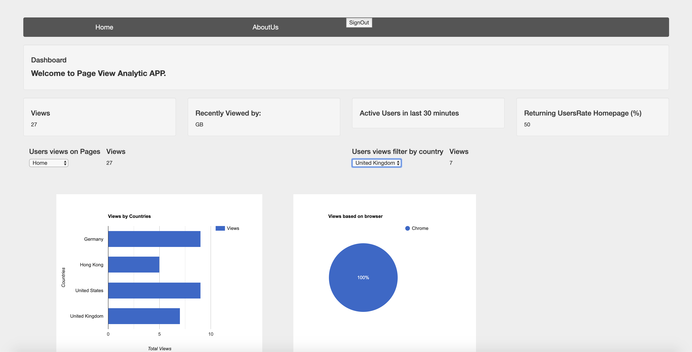

# pageViewAnalysis
A Full stack Application for analysing Web pages

This codebase has been created to demonstrate a Full Stack Page Anaylsis application (Dashboard for analysing web pages).
The service allows measuring the number of views the website had for a particular page and show the analytics in representative away.

Developed application will show you number of views for following page: Home and AboutUS.
Also, it gives you various option to see/filter views according to the requirement.
For example, some of the Filter options are:
- Collect all page views
- Get page views by page id
- Get page views by country
- Get page views by countries. (For sample, we used Germany, India, Unitted Stated and United Kingdom as countries) (Graph)
- Get page views by a browser name
- Get page activity for a last 30 mins.

### Additional Implemetation ###
Backend API calls are secured with JWT token (calling middleware) which gets created everytime when user login.

### Technology Stack ###
Backend: NodeJS, Mongoose
Frontend: HTML, CSS, Bootstrap

For more information on how this works with other frontends/backends, clone this repo and follow instructions.
### Getting Started ###
These instructions will get you a copy of the project up and running on your local machine for development and testing purposes.

### Prerequisites ###
Nodejs

MongoDB (Install mongoDB on local system using https://docs.mongodb.com/manual/administration/install-community/)

Mongoose

Expressjs

### Development Setup ###
Explain how to install all development dependencies.

`git clone https://github.com/himanshunagda/pageViewAnalysis`

 `cd pageViewAnalysis`
 
 `npm i`

### How to initiate MongoDB/Mongoose ###
 `node scripts/mongoInitiate.js`
 
 ### Start the Development server ###
 `npm start`
 
 It starts project on http://localhost:4000/
 
 ### Basic Steps ###
 - Once development server is running, an login page can be accessed on URL http://localhost:4000/
 - For sample login, 3 samples users have been already created. Login with following credentials: 
   
   username: user1 or user2 or user3
   
   password: pass1, pass2. pass3
 - After login, dashboard can be seen as session is created for loggedIn User.
 - Views of web pages (Home and AboutUs) are different from each other.
 
 
 
